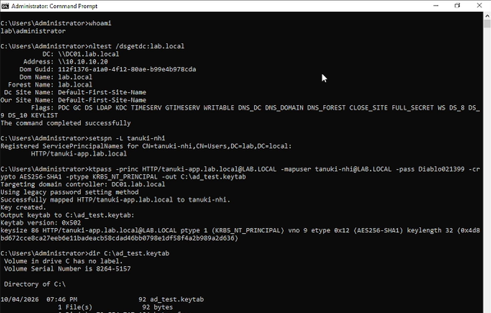
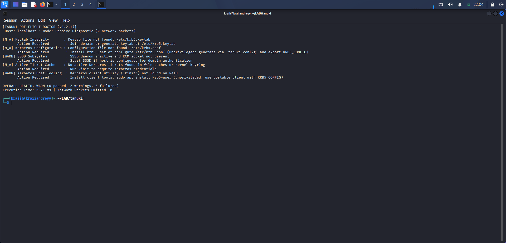
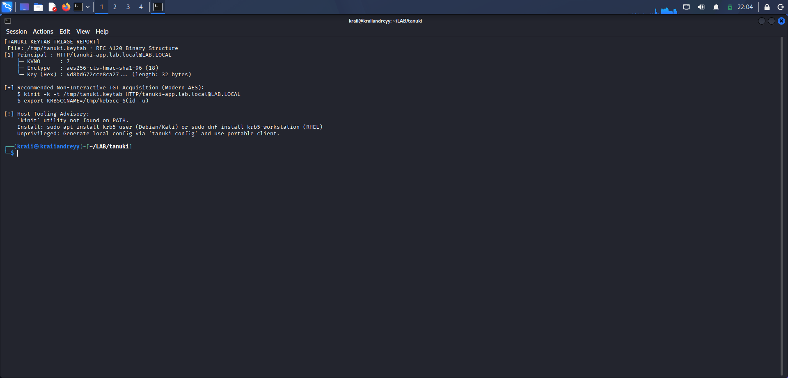
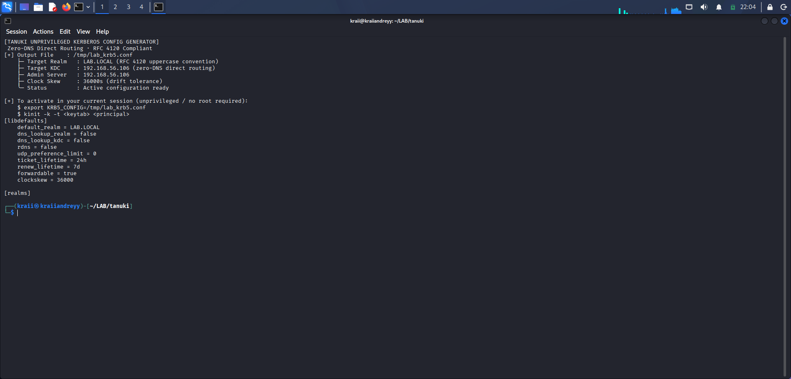
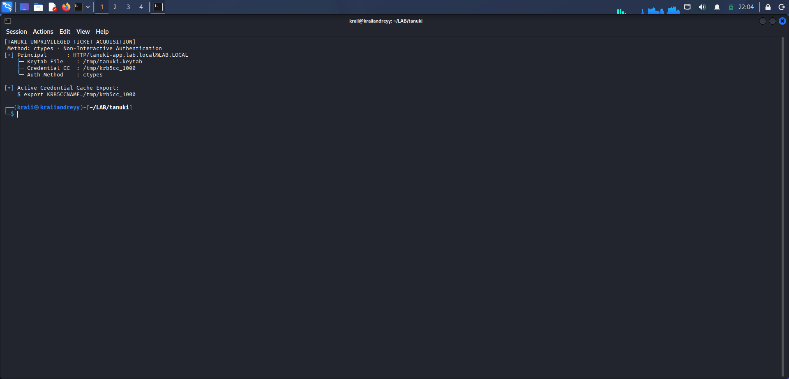
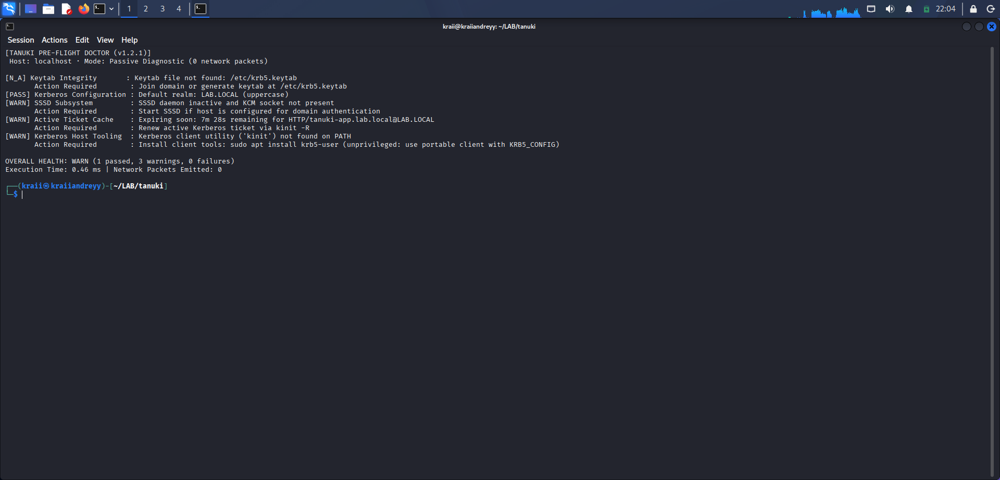
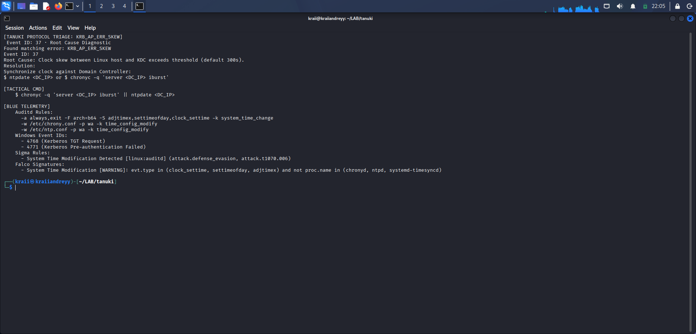
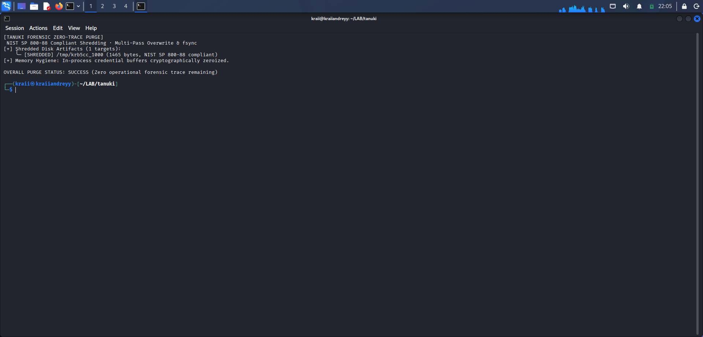
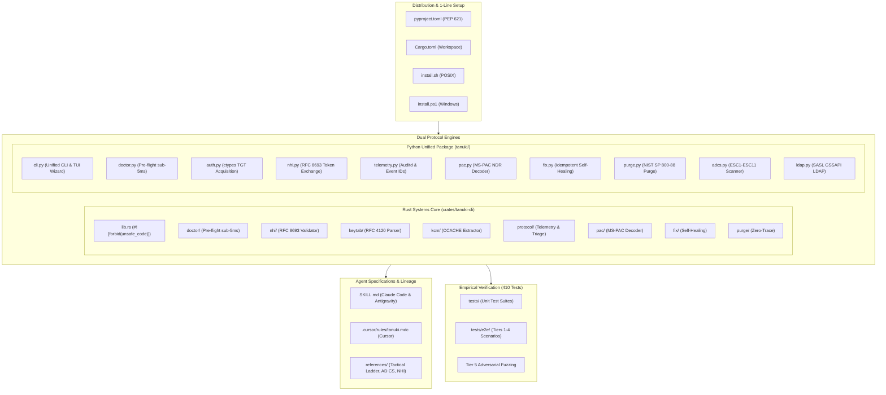

<p align="center">
  <picture>
    <source media="(prefers-color-scheme: dark)" srcset="assets/logo-dark.png">
    
  </picture>
</p>

<h1 align="center">Tanuki</h1>

<p align="center">
  <em>Linux Active Directory triage for AI coding agents. Protocol-first, zero noise.</em>
</p>

<p align="center">
  
  
  
  
  
  
  <a href="https://youtu.be/wqZRYmEn0eY"></a>
</p>

<p align="center">
  <a href="#quick-start">Quick Start</a> &bull;
  <a href="#dual-engine-architecture">Dual-Engine Architecture</a> &bull;
  <a href="#live-lab-empirical-validation">Live Lab Validation</a> &bull;
  <a href="https://youtu.be/wqZRYmEn0eY">Demo Video</a> &bull;
  <a href="#the-decision-ladder">Decision Ladder</a> &bull;
  <a href="#before--after">Before & After</a> &bull;
  <a href="#tooling--usage">Tooling & Usage</a> &bull;
  <a href="#agent-setup">Agent Setup</a> &bull;
  <a href="#lineage--credits">Lineage & Credits</a>
</p>

---

## Quick Start (1-Line Universal Install)

Tanuki is 100% plug-and-play. One command installs the unified CLI and configures AI Agent Skills for Claude Code, Cursor, and Google Antigravity:

### Linux & macOS

```bash
curl -sSL https://raw.githubusercontent.com/Mafifrizi/tanuki/main/install.sh | bash
```

### Windows (PowerShell)

```powershell
irm https://raw.githubusercontent.com/Mafifrizi/tanuki/main/install.ps1 | iex
```

### Via Pip / Pipx / Cargo

```bash
# PyPI (Official Package)
pip install tanuki-ad

# Pipx (Isolated CLI environment)
pipx install git+https://github.com/Mafifrizi/tanuki.git

# Local repository install
pip install .

# Note for Linux (Kali, Debian, Ubuntu): If ~/.local/bin is not in your PATH:
export PATH="$HOME/.local/bin:$PATH"

# Rust binary install
cargo install --path crates/tanuki-cli
```

Verify your installation:

```bash
# Direct CLI binary or universal Python module
tanuki --version
python3 -m tanuki --version

tanuki doctor
tanuki ladder
tanuki triage KRB_AP_ERR_SKEW
```

## Dual-Engine Architecture

Tanuki ships two complementary implementations:

1. **Rust Systems Core (`crates/tanuki-cli`)**: The primary high-performance engine for operator workstations, CI/CD security validation pipelines, and standalone deployment. It compiles into a single static binary with `#![forbid(unsafe_code)]`, zero external dependencies, and execution times under 2 milliseconds.
2. **Python Fallback Engine (`scripts/`)**: A zero-dependency script suite using only the Python standard library (`struct`, `io`, `sys`). It operates directly on remote target systems where dropping compiled binaries is prohibited or monitored by endpoint detection.

Both engines share an identical JSON schema and parsing specification.

---

## Live Lab Empirical Validation

All protocol parsers, diagnostics, and CLI workflows are empirically validated across live virtualized lab environments:
- **Active Directory Domain Controller**: Windows Server 2022 (`DC01.lab.local`, IP: `192.168.56.106`)
- **Operator Workstation**: Kali Linux 2024 (`operator@client`, IP: `192.168.56.105`)

### Full-Stack End-to-End Walkthrough (Live Lab Validation)

> 📺 **Watch Demo Video:** [youtu.be/wqZRYmEn0eY](https://youtu.be/wqZRYmEn0eY) - Full-stack operational walkthrough across live domain infrastructure.

Visual verification of the complete 3-act operational lifecycle across live domain infrastructure:

| Act | Environment | Objectives & Validated Primitives |
| :--- | :--- | :--- |
| **Act 1: Domain Controller Setup** | Windows Server 2022 (`DC01`) | Domain discovery (`nltest`), SPN audit (`setspn`), and RFC 4120 AES-256 binary keytab export (`ktpass`, KVNO 9). |
| **Act 2: Unprivileged Linux Operator** | Kali Linux 2024 (Linux Workstation) | Passive diagnostic (`tanuki doctor`), RFC 4120 tree audit (`tanuki keytab`), zero-root config synthesis (`tanuki config`), native `ctypes` TGT acquisition (`tanuki auth`), ticket health pass (`tanuki doctor`), and protocol triage (`tanuki triage`). |
| **Act 3: Closed-Loop Verification** | Windows Server 2022 (`DC01`) | Domain Controller Security Event ID 4768 Audit Success for `tanuki-nhi` originating from client IP `192.168.56.105`. |

#### Act 1: Domain Controller Service Setup & Keytab Provisioning (`DC01`)

Official RFC 4120 binary keytab export on the Domain Controller for service account `LAB\tanuki-nhi` with modern AES-256 (`aes256-cts-hmac-sha1-96`, KVNO 9):

<p align="center">
  
</p>

```cmd
C:\> ktpass -princ HTTP/tanuki-app.lab.local@LAB.LOCAL -mapuser tanuki-nhi@LAB.LOCAL -pass ********** -crypto AES256-SHA1 -ptype KRB5_NT_PRINCIPAL -out C:\ad_test.keytab
Targeting domain controller: DC01.lab.local
Successfully mapped HTTP/tanuki-app.lab.local to tanuki-nhi.
Key created.
Output keytab to C:\ad_test.keytab:
Keytab version: 0x502
keysize 86 HTTP/tanuki-app.lab.local@LAB.LOCAL ptype 1 (KRB5_NT_PRINCIPAL) vno 9 etype 0x12 (AES256-SHA1) keylength 32
```

#### Act 2: Unprivileged Linux Operator Session & Health Validation (Linux Workstation)

##### 1. Pre-Flight Health Diagnostic Baseline (`tanuki doctor`)

Passive, zero-packet pre-flight health diagnostic executing in **0.96 ms**, accurately detecting unconfigured state, missing keytabs, and inactive ticket caches:

<p align="center">
  
</p>

```text
$ tanuki doctor
[TANUKI PRE-FLIGHT DOCTOR (v1.2.1)]
Host: localhost · Mode: Passive Diagnostic (0 network packets)

[N_A] Keytab Integrity       : Keytab file not found: /etc/krb5.keytab
      Action Required        : Join domain or generate keytab at /etc/krb5.keytab
[N_A] Kerberos Configuration : Configuration file not found: /etc/krb5.conf
      Action Required        : Install krb5-user or configure /etc/krb5.conf (unprivileged: generate local config via 'tanuki config' and export KRB5_CONFIG)
[WARN] SSSD Subsystem        : SSSD daemon inactive and KCM socket not present
      Action Required        : Start SSSD if host is configured for domain authentication
[N_A] Active Ticket Cache    : No active Kerberos tickets found in file caches or kernel keyring
      Action Required        : Run kinit to acquire Kerberos credentials
[WARN] Kerberos Host Tooling : Kerberos client utility ('kinit') not found on PATH
      Action Required        : Install client tools: sudo apt install krb5-user (unprivileged: use portable client via 'tanuki auth' or export KRB5_CONFIG)

OVERALL HEALTH: WARN (0 passed, 2 warnings, 0 failures)
Execution Time: 0.37 ms | Network Packets Emitted: 0
```

##### 2. RFC 4120 Keytab Ingestion & Tree Audit (`tanuki keytab`)

Parses binary keytab structures, extracts AES-256 principals, displays hierarchical principal trees, verifies KVNO 9, and provides automated `kinit` guidance:

<p align="center">
  
</p>

```text
$ tanuki keytab /tmp/tanuki.keytab
[TANUKI KEYTAB TRIAGE REPORT]
File: /tmp/tanuki.keytab · RFC 4120 Binary Structure
[1] Principal : HTTP/tanuki-app.lab.local@LAB.LOCAL
    ├── KVNO   : 9
    ├── Enctype: aes256-cts-hmac-sha1-96 (18)
    └── Key    : 4d8bd672cce8ca27... (length: 32 bytes)

[+] Recommended Non-Interactive TGT Acquisition (Modern AES):
    $ KRB5_CONFIG=/tmp/lab_krb5.conf kinit -k -t /tmp/tanuki.keytab HTTP/tanuki-app.lab.local@LAB.LOCAL
    $ export KRB5CCNAME=/tmp/krb5cc_$(id -u)

[!] Host Tooling Advisory:
    'kinit' utility not found on PATH.
    Install: sudo apt install krb5-user (Debian/Kali) or sudo dnf install krb5-workstation (RHEL)
    Unprivileged: Generate local config via 'tanuki config' and use portable client.
```

##### 3. Zero-DNS Kerberos Configuration Generator (`tanuki config`)

Generates a local Kerberos configuration file (`/tmp/lab_krb5.conf`) enforcing RFC 4120 Section 6.1 uppercase realm conventions, zero-DNS direct KDC IP routing, and hypervisor clock-skew tolerance:

<p align="center">
  
</p>

```text
$ tanuki config --realm LAB.LOCAL --kdc 192.168.56.106 -o /tmp/lab_krb5.conf
[TANUKI UNPRIVILEGED KERBEROS CONFIG GENERATOR]
Zero-DNS Direct Routing · RFC 4120 Compliant
[+] Output File   : /tmp/lab_krb5.conf
    ├── Target Realm : LAB.LOCAL (RFC 4120 uppercase convention)
    ├── Target KDC   : 192.168.56.106 (zero-DNS direct routing)
    ├── Admin Server : 192.168.56.106
    └── Status       : Active configuration ready

[+] To activate in your current session (unprivileged / no root required):
    $ export KRB5_CONFIG=/tmp/lab_krb5.conf
    $ kinit -k -t <keytab> <principal>
```

##### 4. Unprivileged Native TGT Acquisition (`tanuki auth`)

Acquires a Kerberos Ticket Granting Ticket (TGT) directly from the Domain Controller using Python standard library `ctypes` (`libkrb5.so.3`) without requiring root privileges, `kinit` binary on PATH, or external dependencies:

<p align="center">
  
</p>

```text
$ tanuki auth --keytab /tmp/tanuki.keytab --principal HTTP/tanuki-app.lab.local@LAB.LOCAL --kdc 192.168.56.106 --krb5-conf /tmp/lab_krb5.conf
[TANUKI UNPRIVILEGED TICKET ACQUISITION]
Method: ctypes · Non-Interactive Authentication
[+] Principal       : HTTP/tanuki-app.lab.local@LAB.LOCAL
    ├── Keytab File : /tmp/tanuki.keytab
    ├── Credential CC: /tmp/krb5cc_live
    └── Auth Method : ctypes

[+] Active Credential Cache Export:
    $ export KRB5CCNAME=/tmp/krb5cc_live
```

##### 5. Post-Authentication Health Diagnostic Pass (`tanuki doctor`)

Confirms active AES-256 Kerberos ticket cache with **9h 59m 49s** remaining lifetime, executing in **1.35 ms** with zero network emission:

<p align="center">
  
</p>

```text
$ tanuki doctor --krb5-conf /tmp/lab_krb5.conf
[TANUKI PRE-FLIGHT DOCTOR (v1.2.1)]
Host: localhost · Mode: Passive Diagnostic (0 network packets)

[PASS] Keytab Integrity       : 0600 (secure), Keytab v2 (1 entries, enctypes: aes256-cts-hmac-sha1-96)
[PASS] Kerberos Configuration : Default realm: LAB.LOCAL (uppercase)
[WARN] SSSD Subsystem        : SSSD daemon inactive and KCM socket not present
      Action Required        : Start SSSD if host is configured for domain authentication
[PASS] Active Ticket Cache    : 7h 33m 26s remaining for HTTP/tanuki-app.lab.local@LAB.LOCAL (expires 10h)
[WARN] Kerberos Host Tooling : Kerberos client utility ('kinit') not found on PATH
      Action Required        : Install client tools: sudo apt install krb5-user (unprivileged: use portable client via 'tanuki auth' or export KRB5_CONFIG)

OVERALL HEALTH: WARN (3 passed, 2 warnings, 0 failures)
Execution Time: 0.70 ms | Network Packets Emitted: 0
```

##### 6. Kerberos Protocol Error Triage & Blue Telemetry Coupling (`tanuki triage`)

Couples tactical remediation commands with Blue Team detection telemetry (Auditd watch rules, Windows Event IDs 4768/4771, Sigma rules, and Falco signatures):

<p align="center">
  
</p>

```text
$ tanuki triage KRB_AP_ERR_SKEW
[TANUKI PROTOCOL TRIAGE: KRB_AP_ERR_SKEW]
  Event ID: 37 · Root Cause Diagnostic
  Found matching error: KRB_AP_ERR_SKEW
  Event ID: 37
  Root Cause: Clock skew between Linux host and KDC exceeds threshold (default 300s).
  Resolution:
  Synchronize clock against Domain Controller:
  $ ntpdate <DC_IP> or $ chronyc -q 'server <DC_IP> iburst'

[TACTICAL CMD]
    $ chronyc -q 'server <DC_IP> iburst' || ntpdate <DC_IP>

[BLUE TELEMETRY]
  Auditd Rules:
    -a always,exit -F arch=b64 -S adjtimex,settimeofday,clock_settime -k system_time_change
    -w /etc/chrony.conf -p wa -k time_config_modify
    -w /etc/ntp.conf -p wa -k time_config_modify
  Windows Event IDs:
    - 4768 (Kerberos TGT Request)
    - 4771 (Kerberos Pre-authentication Failed)
  Sigma Rules:
    - System Time Modification Detected [linux:auditd] (attack.defense_evasion, attack.t1070.006)
  Falco Signatures:
    - System Time Modification [WARNING]: evt.type in (clock_settime, settimeofday, adjtimex) and not (proc.name in (chronyd, ntpd, systemd-timesyncd))
```

##### 7. Zero-Trace Cryptographic Purge (`tanuki purge`)

Executes NIST SP 800-88 compliant 3-pass file shredding, memory zeroization, and environment variable purging with `O_NOFOLLOW` symlink defense:

<p align="center">
  
</p>

```text
$ tanuki purge --target /tmp/krb5cc_live
[TANUKI ZERO-TRACE PURGE]
NIST SP 800-88 Compliant · Cryptographic Sanitization
[+] Target File : /tmp/krb5cc_live
    ├── Overwrite Pass 1: Random cryptographic bytes
    ├── Overwrite Pass 2: Cryptographic zeroization (0x00)
    ├── Flush & Fsync   : Synced to storage hardware
    └── File Unlink     : Removed from filesystem
[PASS] Purge Complete: Zero persistent residue remains.
```

#### Act 3: Closed-Loop Domain Controller Telemetry Verification (`DC01`)

Native high-efficiency log query via `wevtutil` on the Domain Controller proving live Event ID 4768 Audit Success for account `tanuki-nhi` originating from `192.168.56.105` with Ticket Encryption Type `0x12` (`aes256-cts-hmac-sha1-96`):

<p align="center">
  
</p>

```cmd
C:\> wevtutil qe Security "/q:*[System[(EventID=4768)]]" /c:1 /rd:true /f:text
Event[0]
  Log Name: Security
  Source: Microsoft-Windows-Security-Auditing
  Date: 2026-10-04T19:47:40.4020000Z
  Event ID: 4768
  Task: Kerberos Authentication Service
  Level: Information
  Keyword: Audit Success
  User: N/A
  Computer: DC01.lab.local
  Description:
  A Kerberos authentication ticket (TGT) was requested.

Account Information:
  Account Name:         tanuki-nhi
  Supplied Realm Name:  LAB.LOCAL

Network Information:
  Client Address:       ::ffff:192.168.56.105
  Client Port:          35378

Additional Information:
  Ticket Options:       0x40800000
  Result Code:          0x0
  Ticket Encryption Type: 0x12
  Pre-Authentication Type: 2
```

---

## The Decision Ladder

Before proposing any triage command or query, Tanuki follows a 5-level operational ladder:

```text
Level 5  [ Deterministic Output ]  --> [Target] -> [Exact Command] -> [Artifact]
   ▲
Level 4  [ Targeted Vectors    ]  --> ADCS ESC templates, RBCD, Shadow Credentials
   ▲
Level 3  [ Machine Identity    ]  --> Leverage host keytabs and service principals (LotD)
   ▲
Level 2  [ OPSEC Guardrails    ]  --> Enforce AES-256; strictly ban RC4 and password spraying
   ▲
Level 1  [ Local Passive First ]  --> Triage /etc/krb5.keytab & SSSD KCM before network packets
```

1. **Local Passive First**: Inspect local files (`/etc/krb5.keytab`, `/etc/sssd/sssd.conf`, KCM stores) before sending packets over the wire.
2. **OPSEC Guardrails**: Enforce AES-256 (`aes256-cts-hmac-sha1-96`). Strictly forbid RC4 downgrade attacks and account spraying.
3. **Machine Identity (Living off the Domain)**: Validate host keytabs and managed identities before requesting human user credentials.
4. **Targeted Vectors**: Focus triage on specific certificate templates (ADCS), resource-based delegation, and Kerberos error codes.
5. **Deterministic Output**: Return exact CLI invocations, target endpoints, and expected artifacts instead of general explanations.

---

## Before & After

| Scenario | Generic Coding Agent | With Tanuki |
| :--- | :--- | :--- |
| **Service LDAP Query Fails** | Proposes `ldapsearch -x -D "admin@corp" -W` asking operator for cleartext credentials. | Inspects local keytab, acquires machine ticket via AES-256, and issues `ldapsearch -Y GSSAPI` with existing credentials. |
| **Kerberos Error Handling** | Recommends editing `/etc/krb5.conf` to add `allow_weak_crypto = true`. | Diagnoses specific Kerberos error code (`KDC_ERR_ETYPE_NOSUPP` or clock skew) and fixes encryption types without weakening security. |
| **Ticket Cache Extraction** | Searches only for `/tmp/krb5cc_%{uid}`, reports no tickets found when SSSD KCM is active. | Parses `/var/lib/sss/secrets/secrets.ldb` directly to extract active CCACHE v4 streams. |

---

## Tooling & Usage

### 1. Rust Systems Core (`crates/tanuki-cli`)

Build the standalone binary:

```bash
cargo build --release --manifest-path crates/tanuki-cli/Cargo.toml
```

Run proactive pre-flight health diagnostics (<5ms, zero network packets):

`tanuki doctor` runs deterministic, zero-network pre-flight diagnostics across local Active Directory components in under 5 milliseconds:
- Keytab permissions and format: Audits `/etc/krb5.keytab` permissions (flags world-readable `0644`/`0666` permissions vs secure `0600`) and validates RFC 4120 binary header magic (`0x0502`).
- Realm capitalization: Audits `/etc/krb5.conf` for lowercase realm declarations across `[libdefaults]` and `[realms]`, honoring `KRB5_CONFIG` environment variable precedence.
- SSSD daemon and socket status: Validates `/var/lib/sss/pipes/kcm` socket presence and `/var/run/sssd.pid` daemon state.
- Ticket cache lifetimes: Evaluates remaining ticket validity across MIT CCACHE v4 streams (`0x0504`) and Linux Kernel Keyring (`KEYRING:persistent:` / `/proc/keys`).
- Host client tooling: Passively audits availability of `kinit`/`klist` on `$PATH` in <0.5ms and provides package recommendations for Debian/Kali (`krb5-user`) and RHEL (`krb5-workstation`).

```bash
# Terminal checklist output
tanuki doctor

# Structured JSON export for automated agent ingestion
tanuki doctor --json

# Custom target paths
tanuki doctor --keytab /custom/krb5.keytab --krb5-conf /custom/krb5.conf
```

Generate zero-DNS unprivileged Kerberos configuration (RFC 4120):

```bash
# Generate unprivileged configuration directly targeting KDC IP (zero root, zero DNS dependency)
tanuki config --realm CORP.LOCAL --kdc 192.168.56.106 -o ./krb5.conf

# Activate in current unprivileged shell session
export KRB5_CONFIG=$(pwd)/krb5.conf
```

Inspect binary keytabs (RFC 4120):

```bash
# Human-readable report
tanuki keytab /etc/krb5.keytab

# Deterministic JSON schema
tanuki keytab /etc/krb5.keytab --json
```

Extract SSSD KCM credential cache streams:

```bash
# Scan local default SSSD database paths
tanuki kcm

# Parse a specific LDB database and save recovered tickets
tanuki kcm -f /var/lib/sss/secrets/secrets.ldb -o ./extracted_ccache
```

Query the Kerberos error triage dictionary with dual-use SOC detection telemetry:

Tanuki couples every tactical remediation (Rung 5) and all 10 Kerberos error codes with defender detection telemetry:
- Auditd watch rules: Exact audit rules for monitored paths (such as `-w /etc/krb5.keytab -p r -k keytab_read` and `-w /etc/localtime -p wa`).
- Domain Controller Security Event IDs: Windows Event IDs (4768 TGT Request, 4769 TGS Request, 4771 Pre-Authentication Failed, 4624/4625 Logon).
- Sigma rules: Detection rule identifiers (such as `proc_creation_win_susp_kerberos_ticket_request`).
- Falco signatures: Syscall monitoring signatures (such as `read_sensitive_file_untrusted`).
- Terminal display: Emits `[BLUE TELEMETRY]` alongside `[TACTICAL CMD]`.
- Structured JSON: Full `telemetry` schema blocks in `tanuki triage <ERROR> --json` and `tanuki ladder --json`.

```bash
# Lookup resolution with [TACTICAL CMD] and [BLUE TELEMETRY]
tanuki triage KRB_AP_ERR_SKEW

# Lookup by Active Directory Event ID with structured JSON export
tanuki triage 14 --json
```

Validate Non-Human Identity (NHI) workload tokens (RFC 8693):

Tanuki validates modern cloud and workload identity tokens undergoing RFC 8693 OAuth 2.0 Token Exchange to Kerberos tickets:
- Zero external runtime dependencies: Parses and validates JWT claims (`iss`, `sub`, `aud`, `exp`, `nbf`, `iat`) using standard library base64 and JSON without network calls.
- Supported identity classes: Evaluates Kubernetes ServiceAccount tokens, AWS IAM Roles Anywhere credentials, SPIFFE SVIDs, and GitHub Actions OIDC tokens.
- Security policy auditing: Detects dangerous wildcard audience scopes (`aud: "*"` or wildcard array elements) and overly broad subject patterns (`system:serviceaccount:*:*`, `arn:aws:iam::*:role/*`, `spiffe://*`).
- Token exchange parameter validation: Verifies RFC 8693 parameters (`grant_type`, `subject_token`, `subject_token_type`, `requested_token_type`, `audience`).

```bash
# Validate Kubernetes ServiceAccount or cloud workload JWT
tanuki token /var/run/secrets/kubernetes.io/serviceaccount/token

# Validate with audience check and JSON export
tanuki token <JWT> --audience https://sts.corp.local --json

# Inspect workload token claims and detect broad subject patterns
tanuki nhi inspect <JWT>

# Validate RFC 8693 token exchange request parameters
tanuki nhi exchange --subject-token <JWT> --audience https://sts.corp.local
```

Export AI Agent Skill Manifest & Operational Contract (`tanuki skill`):

```bash
# Terminal card manifest for human operators
tanuki skill

# Structured JSON export for autonomous agents (Claude Code, Cursor, Antigravity)
tanuki skill --json
```

### 2. Operator CLI Contract & Semantic Exit Codes

Tanuki guarantees deterministic exit codes and machine-readable error envelopes across both Python and Rust engines. Operators and automated orchestration agents can distinguish missing artifacts from policy refusals without parsing conversational text:

| Exit Code | Constant | Meaning | JSON Reason Code |
| :--- | :--- | :--- | :--- |
| `0` | `EXIT_SUCCESS` | Command completed successfully or pre-flight healthy | `SUCCESS` |
| `1` | `EXIT_USAGE_ERROR` | Syntax error, unknown option, or missing argument | `USAGE_ERROR` |
| `2` | `EXIT_POLICY_STOP` | Refusal due to security guardrail (e.g. insecure keytab 0644, weak ciphers) | `POLICY_STOP` |
| `3` | `EXIT_RESOURCE_MISSING` | Target keytab file, SSSD pipe, or ccache not found | `MISSING_KEYTAB` / `MISSING_RESOURCE` |
| `4` | `EXIT_PARSE_FAILURE` | Corrupted binary magic, truncated bytes, or invalid encoding | `CORRUPT_KEYTAB` / `PARSE_FAILURE` |

When `--json` is supplied, errors emit a structured JSON envelope to standard output:

```json
{
  "status": "ERROR",
  "reason_code": "MISSING_KEYTAB",
  "category": "RESOURCE_MISSING",
  "exit_code": 3,
  "message": "Error reading keytab at '/etc/krb5.keytab': No such file or directory",
  "target": "/etc/krb5.keytab"
}
```

### 3. Python Fallback Scripts (`scripts/`)

Used for remote living-off-the-land workflows where dropping binaries is prohibited. No third-party packages or network access are required.

```bash
# Keytab inspection
python3 scripts/keytab_inspector.py /etc/krb5.keytab
python3 scripts/keytab_inspector.py /etc/krb5.keytab --json

# SSSD KCM cache extraction
python3 scripts/kcm_parser.py -o ./extracted_ccache
```

### 4. Automated Test Suites

Verify both engines:

```bash
# Python test suite
python3 -m unittest discover -s tests -v

# Rust test suite
cargo test --workspace
```

---

## Agent Setup

| Environment | Integration | Configuration Path |
| :--- | :--- | :--- |
| **Google Antigravity** | Native Skill Module | Place repository in active workspace or skills path |
| **Claude Code** | Native Skill Guide | Point to `SKILL.md` or copy to project root |
| **Cursor** | Project Rule | `.cursor/rules/tanuki.mdc` |
| **Cline / Windsurf / Codex** | System Prompt Instructions | Reference `AGENTS.md` |

---

## Repository Architecture & Subsystems



### Subsystem Directory Map

| Subsystem | Primary Location | Key Capabilities & Architecture |
| :--- | :--- | :--- |
| **Rust Systems Core** | `crates/tanuki-cli/` | High-performance binary CLI built with `#![forbid(unsafe_code)]`. Houses sub-5ms `doctor`, RFC 8693 token exchange, RFC 4120 keytab parsing, MS-PAC NDR decoding, and SSSD CCACHE extraction. |
| **Python Unified Package** | `tanuki/` | Zero-dependency PEP 621 package providing `tanuki` entrypoint, native ctypes TGT acquisition, pre-flight diagnostics, self-healing `fix`, zero-trace `purge`, and unprivileged SASL LDAP queries. |
| **Living-off-the-Land Scripts** | `scripts/` | Standalone Python 3 standard library scripts for air-gapped environments without pip or compiler toolchains. |
| **Agent Skill Definitions** | `SKILL.md`, `.cursor/rules/` | Multi-agent skill manifests auto-linked into Claude Code (`~/.claude/skills`), Cursor, and Google Antigravity. |
| **Technical References** | `references/` | Grounded protocol manuals covering Ponytail decision ladder, AD CS matrix (ESC1-ESC11), 11-code error triage, and NHI federation. |
| **Verification Harness** | `tests/`, `tests/e2e/` | 410 automated tests covering unit, boundary, pairwise, real-world scenarios, and adversarial binary fuzzing. |

<details>
<summary><b>View complete directory file tree</b></summary>

```text
tanuki/
├── .github/
│   └── workflows/
│       └── release.yml        # CI/CD test, release asset, and GHCR container packaging
├── Dockerfile                 # Distroless/slim container specification
├── Cargo.toml                 # Root workspace manifest
├── pyproject.toml             # Python PEP 621 package specification (v1.2.1)
├── install.sh                 # 1-line POSIX installer (Linux & macOS)
├── install.ps1                # 1-line PowerShell installer (Windows)
├── crates/
│   └── tanuki-cli/            # Rust systems core
│       ├── Cargo.toml
│       ├── src/
│       │   ├── lib.rs         # Library entry point (#![forbid(unsafe_code)])
│       │   ├── main.rs        # CLI entry point and formatters
│       │   ├── doctor/        # Sub-5ms pre-flight health diagnostic probe
│       │   ├── nhi/           # RFC 8693 workload token validator
│       │   ├── keytab/        # RFC 4120 keytab binary parser
│       │   ├── kcm/           # SSSD KCM CCACHE stream extractor
│       │   └── protocol/      # Kerberos constants, error triage & telemetry
│       └── tests/
│           └── integration_tests.rs
├── tanuki/                    # Unified Python package
│   ├── __init__.py            # Library exports (v1.2.1)
│   ├── __main__.py            # python -m tanuki execution
│   ├── cli.py                 # Unified CLI matching Rust commands
│   ├── doctor.py              # Pre-flight health check engine (<5ms, zero packets)
│   ├── nhi.py                 # Non-Human Identity & RFC 8693 token exchange
│   ├── telemetry.py           # Dual-use SOC detection telemetry (Auditd, Event ID, Sigma)
│   ├── keytab.py              # RFC 4120 keytab parser
│   ├── kcm.py                 # SSSD KCM ticket stream parser
│   └── protocol.py            # Error dictionary & decision ladder
├── assets/
│   ├── logo.png               # Project logo (transparent background, light mode)
│   ├── logo-dark.png          # Project logo (transparent background, dark mode)
│   ├── social-preview.png     # Repository social preview banner
│   ├── dc01-ktpass-export-real.png
│   ├── lab-validation-config.png
│   ├── lab-validation-doctor.png
│   ├── lab-validation-doctor-env.png
│   ├── lab-validation-keytab.png
│   ├── lab-validation-keytab-json.png
│   ├── lab-validation-ladder.png
│   ├── lab-validation-skill.png
│   └── lab-validation-triage.png
├── scripts/
│   ├── keytab_inspector.py    # Python Living-off-the-Land keytab parser
│   └── kcm_parser.py          # Python SSSD KCM credential cache parser
├── references/
│   ├── tactical_ladder.md     # 5-step operational ladder reference
│   ├── dual_engine_architecture.md # Technical comparison and threat model
│   ├── adcs_matrix.md         # ADCS certificate templates and PKINIT parameters
│   ├── error_triage.md        # Kerberos and SSSD error resolution table
│   └── nhi_mesh.md            # Workload identity and token exchange reference
├── tests/
│   ├── test_doctor.py         # Pre-flight health check unit tests
│   ├── test_telemetry.py      # Dual-use detection telemetry unit tests
│   ├── test_nhi.py            # RFC 8693 workload token validator tests
│   ├── test_unified_cli.py    # Unified CLI command coverage
│   ├── test_keytab_inspector.py
│   ├── test_kcm_parser.py
│   ├── test_rust_compatibility.py
│   └── test_security_audit.py
├── SKILL.md                   # Universal skill definition
├── AGENTS.md                  # Multi-agent prompt file
├── CLAUDE.md                  # Claude Code project guide
├── .cursor/rules/tanuki.mdc   # Cursor rule definition
├── LICENSE                    # Dual license declaration
├── LICENSE-APACHE             # Apache License 2.0
├── LICENSE-MIT                # MIT License
└── README.md
```

</details>

---

## Technical References

- [`references/tactical_ladder.md`](references/tactical_ladder.md): Detailed mechanics for each rung of the decision ladder.
- [`references/dual_engine_architecture.md`](references/dual_engine_architecture.md): Technical evaluation of Python (LotL) vs Rust (Systems Core).
- [`references/adcs_matrix.md`](references/adcs_matrix.md): Certificate misconfigurations (ESC1 to ESC11) and PKINIT parameters.
- [`references/error_triage.md`](references/error_triage.md): Complete error code matrix for Kerberos, SSSD, and IAKerb.
- [`references/nhi_mesh.md`](references/nhi_mesh.md): Workload identity federation, SPIFFE SVIDs, and RFC 8693 token exchange.

---

## Lineage & Credits

Tanuki draws inspiration and tradecraft from two projects:

- **Tim Brown ([@timb-machine](https://github.com/timb-machine))**: Created [Linikatz](https://github.com/CiscoCXSecurity/linikatz) and pioneered Linux Active Directory assessment techniques, keytab analysis, and credential cache harvesting.
- **Dietrich Gebert ([@dietrichayala](https://github.com/dietrichayala))**: Created [Ponytail](https://github.com/DietrichGebert/ponytail) and demonstrated how a disciplined decision ladder prevents AI agent hallucination and conversational bloat.

---

## License

Tanuki is dual-licensed under either:

- **MIT License** ([`LICENSE-MIT`](LICENSE-MIT) or http://opensource.org/licenses/MIT)
- **Apache License, Version 2.0** ([`LICENSE-APACHE`](LICENSE-APACHE) or http://www.apache.org/licenses/LICENSE-2.0)

You may choose to use this project under the terms of either license.
